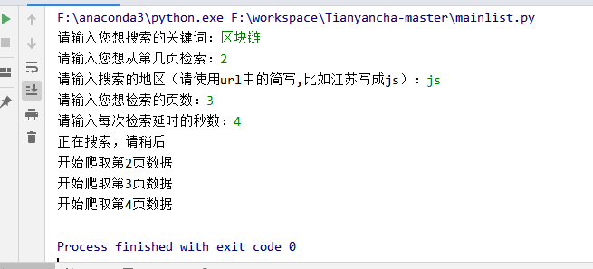
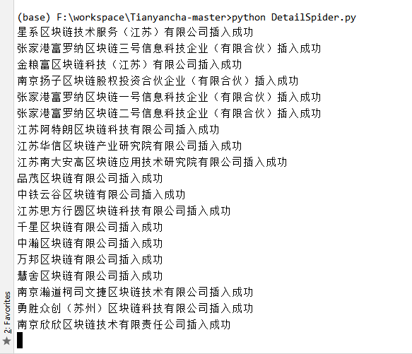
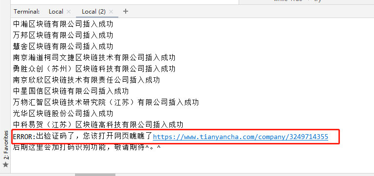
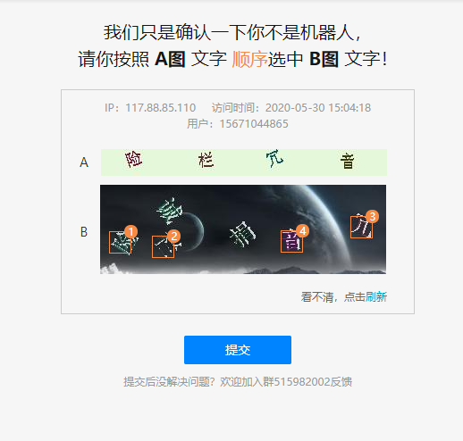

# 基于Python的天眼查爬虫，爬取完整的公司数据
#### 运行前请将自己的cookie替换settings中的第42行的Cookie。

PS：<a href="https://blog.csdn.net/MuWinter/article/details/75313476" rel="nofollow">小白怎么拿到cookie？点击查看</a>

### 字段说明
xid:我自己设计的字段，为的是方便查看记录是什么时候开始爬取的，以及在第几页第几行。用"\_"分割。 (1)\_(2)_(3) 1表示第几页，2表示第几行，3表示这条记录的开始爬取的时间（即列表页面爬取的时间）。 

name:公司名

state:公司状态

r_name:法人名

money:注册资本

date:成立日期

r_phone:法人电话

r_email:邮箱

company_address:公司地址

registe_address:公司注册地址

industry:行业

company_type:公司类型

business_scope:经营范围

staff_size:人员规模

### 运行方法，
1. 本项目有两部分组成列表页面mainlist.py和详情页面DetailSpider.py。
2. 本项目用到的编程语言为python,数据库用到了Mysql和redis。所以你的电脑或者服务器中需要有这几样东西。PS：<a href="https://www.runoob.com/redis/redis-install.html" rel="nofollow">小白怎么在windows中安装redis？</a>
3. 先运行mainlist.py，如图，按照自己的需求输入 

4. 再运行DetailSpider.py，PS：可以在另一个窗口开 

5. 如果撞到了机制墙，那么爬取的页面会返给你一个验证码的页面，此时，终端会提示你需要点验证码了。 

6. 点击验证码，告诉天眼查你不是机器人，而是一个伪装成机器人的人类。然后再运行DetailSpider程序，这个时候程序会记得你上次停下来的位置。并从那里继续向下爬取。 

### 补充：
1. 本项目有日志模块，但只记录错误日志，为的是方便后面排错。路径为log/logger.log
2. 本项目最终数据存储在mysql中，表设计如下图，（这里是为了方便，简单的设计了下，您也可以根据自己的需求修改。）

博客：<a href="http://zhangxiaodai.life">zhangxiaodai.life</a>
